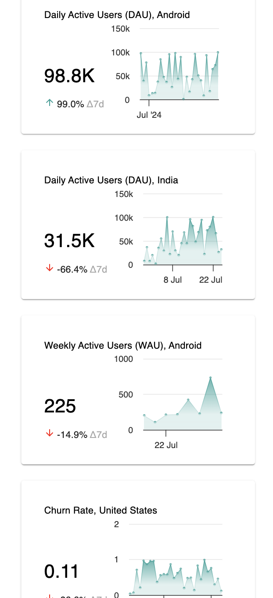

# Metric Tiles

This project involves creating a grid component for KPI cards with toggleable view and edit modes. Users can add new cards via "+" icons, which start in edit mode. The layout adapts to screen width, ensuring a maximum of three cards per row and a centered container.

### Demo

- Website - https://metrictile.netlify.app/
- Video - https://youtu.be/r3hWHqfsw7k

- 
- 
- 
- 
  
  
### Tech Stack

- React
- Typescript
- CSS
- Highcharts

